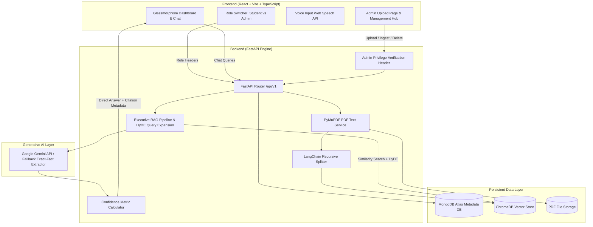

# UniGuide AI – Indian University Information Assistant (MERN + RAG)

> A production-ready, full-stack Retrieval-Augmented Generation (RAG) assistant designed for Indian University students to query official PDF documents (admission guidelines, fee structures, examin[...]


---

## 🎬 Demo Video

<div align="center">
<iframe src="https://drive.google.com/file/d/1KwtBSWSbu_Wxh8rFHdeJNfqwqW006rmq/preview" width="720" height="420" allow="autoplay; encrypted-media" frameborder="0"></iframe>
</div>

**Watch the full demo (Google Drive):** [View Demo Video](https://drive.google.com/file/d/1KwtBSWSbu_Wxh8rFHdeJNfqwqW006rmq/view?usp=sharing)

> Note: GitHub's README rendering may strip or block iframes for security; if the inline preview does not display on GitHub, use the link above to view the video on Google Drive. For embedding in [...]

See UniGuide AI in action as it processes university PDFs, answers student queries with confidence scores, and exports chat sessions in real-time.

---

## 🌐 Live Application & Deployment Links

| Resource | URL Link | Status |
| :--- | :--- | :--- |
| **🚀 Live Demo App (Vercel)** | [https://uniguide-ai.vercel.app](https://uniguide-ai.vercel.app) | `Active (Production)` |
| **🚀 Live Demo App (Render)** | [https://rag-document-ihnt.onrender.com](https://rag-document-ihnt.onrender.com) | `Active (Production)` |
| **⚙️ Backend API Endpoint** | [https://uniguide-backend.onrender.com/api/v1](https://uniguide-backend.onrender.com/api/v1) | `Online` |
| **📖 OpenAPI Swagger Docs** | [https://uniguide-backend.onrender.com/docs](https://uniguide-backend.onrender.com/docs) | `Interactive` |
| **💻 Frontend URL** | [https://uniguide-ai.vercel.app](https://uniguide-ai.vercel.app) | `Vite + React 18` |

---

## 🌟 Key Features & Architecture

- 🍃 **MongoDB Atlas Metadata Store**: Document metadata, upload records, and ingestion status are persisted in MongoDB Atlas for consistency with MERN stack standards.
- 🔐 **Admin Upload Page & RBAC**: Dedicated Admin Upload Hub for administrators to upload PDFs, run vector index chunking, and purge files. Students enjoy a search & Q&A interface without admin[...]
- 🧠 **ChromaDB Vector Database**: Persistent vector embeddings with sentence-transformer embeddings (`BAAI/bge-small-en-v1.5` / `all-MiniLM-L6-v2`).
- 🎯 **Clean Direct Answers**: Strips away OCR noise, raw context headers, and document tags to present concise, exact answers directly to the student.
- ⚡ **Dynamic RAG Confidence Score Engine**: Calculates real-time mathematical confidence scores ($0.0 - 1.0$) and qualitative ratings (`High Confidence`, `Medium Confidence`, `Low Confidence`).
- 📄 **Page-Level Vector Ingestion**: Extracts text page-by-page using PyMuPDF (`fitz`) while maintaining precise source and page metadata across chunking stages.
- 🎙️ **Voice Input Support**: Integrated Web Speech Recognition API allowing hands-free voice questions in the interactive chat interface.
- 💾 **Export Chat Guidance**: Export full student Q&A sessions into formatted Markdown (`.md`) files for printing or offline review.

---

## 🏗️ System Architecture



---

## 📁 Project Folder Structure

```
rag_documents/
├── backend/
│   ├── app/
│   │   ├── api/
│   │   │   └── v1/
│   │   │       ├── endpoints/
│   │   │       │   ├── chat.py            # RAG Q&A query execution
│   │   │       │   ├── documents.py       # MongoDB document list & stats
│   │   │       │   │   ├── ingest.py          # Admin vector embedding ingestion
│   │   │       │   │   └── upload.py          # Admin PDF upload & MongoDB sync
│   │   │       │   └── router.py              # API v1 router definition
│   │   │       └── router.py              # API v1 router definition
│   │   ├── core/
│   │   │   ├── config.py                  # Pydantic environment & Atlas settings
│   │   │   ├── database.py                # MongoDB Atlas PyMongo client & repo
│   │   │   │   ├── logging.py                 # Structured logger setup
│   │   │   │   └── security.py                # Admin role authorization guard
│   │   │   └── security.py                # Admin role authorization guard
│   │   ├── models/
│   │   │   └── document.py                # MongoDB Document metadata model
│   │   ├── rag/
│   │   │   ├── embeddings.py              # HuggingFace Embeddings loader
│   │   │   │   ├── pipeline.py                # RAG pipeline, HyDE & confidence math
│   │   │   │   ├── text_splitter.py           # Recursive page chunker
│   │   │   │   └── vector_store.py            # ChromaDB vector store manager
│   │   │   ├── pipeline.py                # RAG pipeline, HyDE & confidence math
│   │   │   ├── text_splitter.py           # Recursive page chunker
│   │   │   └── vector_store.py            # ChromaDB vector store manager
│   │   ├── schemas/                       # Pydantic request/response schemas
│   │   └── services/                      # PyMuPDF PDF extraction service
│   │   ├── services/                      # PyMuPDF PDF extraction service
│   ├── chroma_db/                         # Persistent ChromaDB vector index
│   ├── uploads/                           # Local PDF file storage
│   ├── Dockerfile                         # Backend container dockerfile
│   ├── main.py                            # FastAPI application entrypoint
│   └── requirements.txt                   # Python backend dependencies
├── frontend/
│   ├── src/
│   │   ├── components/
│   │   │   ├── ChatInterface.tsx          # Q&A conversation interface
│   │   │   ├── ChatMessage.tsx            # Message card with confidence badge
│   │   │   ├── CitationCard.tsx           # Page-level PDF source citation
│   │   │   ├── DocumentManager.tsx        # Document browser & FAQ modal
│   │   │   ├── Navbar.tsx                 # Header with Student/Admin role switcher
│   │   │   └── Sidebar.tsx                # System navigation & ChromaDB status
│   │   ├── pages/
│   │   │   ├── AdminUploadPage.tsx        # Dedicated Admin PDF Upload & Index Hub
│   │   │   ├── Dashboard.tsx              # Student Q&A dashboard & metrics
│   │   │   └── SettingsPage.tsx           # System architecture overview
│   │   ├── services/
│   │   │   └── api.ts                     # Axios client with Admin headers
│   │   ├── types/                         # TypeScript interfaces & UserRole
│   │   ├── App.tsx                        # Master React layout & state router
│   │   │   └── main.tsx                       # React DOM entry point
│   ├── Dockerfile                         # Frontend container dockerfile
│   └── vite.config.ts                     # Vite build configuration
├── docker-compose.yml                     # Multi-container launch orchestrator
├── LICENSE                                # MIT Open Source License
├── README.md                              # Technical documentation
├── render.yaml                            # Render Blueprint deployment configuration
└── start_production.sh                    # Automated local startup launcher script
```

---

## 🛰️ REST API Specifications

| Method | Endpoint | Access Role | Description |
| :--- | :--- | :--- | :--- |
| `POST` | `/api/v1/chat` | `Student / Admin` | Submits chat question, performs similarity search, and returns direct answer with confidence score and page citations. |
| `GET` | `/api/v1/documents` | `Student / Admin` | Returns list of uploaded PDF documents and MongoDB Atlas metadata. |
| `GET` | `/api/v1/documents/stats` | `Student / Admin` | Returns aggregate metrics (total files, ingested vectors, extracted pages). |
| `GET` | `/api/v1/documents/{id}/faqs` | `Student / Admin` | Auto-generates structured admission FAQs for a specific document. |
| `POST` | `/api/v1/upload` | 🔒 `Admin Only` | Uploads a university PDF document and registers metadata in MongoDB Atlas. |
| `POST` | `/api/v1/ingest` | 🔒 `Admin Only` | Extracts text, generates dense vector embeddings, and indexes chunks in ChromaDB. |
| `DELETE` | `/api/v1/documents/{id}` | 🔒 `Admin Only` | Removes PDF file, purges vector embeddings from ChromaDB, and deletes metadata from MongoDB Atlas. |

---

## 💻 Tech Stack

- **Frontend**: React 18, TypeScript, Vite, TailwindCSS, Axios, Lucide Icons, React Markdown, Web Speech API.
- **Backend**: Python 3.9+, FastAPI, PyMuPDF (`fitz`), PyMongo (MongoDB Atlas Driver), Pydantic v2.
- **Metadata Database**: MongoDB Atlas.
- **Vector DB & ML**: LangChain, ChromaDB, `BAAI/bge-small-en-v1.5` / `all-MiniLM-L6-v2` embeddings, Google Gemini API (`google-genai`).

---

## 🚀 Quickstart & Setup Guide

### Method 1: Running via Local Launch Script

```bash
bash start_production.sh
```

---

### Method 2: Manual Setup

#### Step 1: Backend Setup
```bash
cd backend
python3 -m venv venv
source venv/bin/activate  # On Windows: venv\Scripts\activate
pip install -r requirements.txt

# Configure Environment Variables
cp .env.example .env
# Set your GEMINI_API_KEY and MONGODB_URI inside backend/.env

# Launch FastAPI Server
python main.py
```
*Backend runs at:* `http://localhost:8000` (Swagger docs at `http://localhost:8000/docs`)

#### Step 2: Frontend Setup
```bash
cd frontend
export PATH=/Users/livesh/recommendation/node_bin/bin:$PATH
npm install
npm run dev
```
*Frontend runs at:* `http://localhost:3000`

---

## 🔮 Future Enhancements

- [ ] **Multi-Tenant University Support**: Segregate document repositories and vector collections by university branch and department.
- [ ] **Hybrid BM25 + Vector Search**: Combine sparse keyword search with dense embeddings for optimal accuracy on alphanumeric course codes and fee figures.
- [ ] **OAuth2 JWT Authentication**: Production user login system supporting OAuth2 social login (Google/GitHub) and RBAC claims.
- [ ] **Automated OCR Preprocessing**: Integrated Tesseract/EasyOCR fallback for scanned PDF documents.
- [ ] **Real-Time Webhook Notifications**: Trigger push notifications when new admission brochures are uploaded and indexed.

---

## 🛡️ License

Distributed under the MIT License. See [LICENSE](LICENSE) for details.
