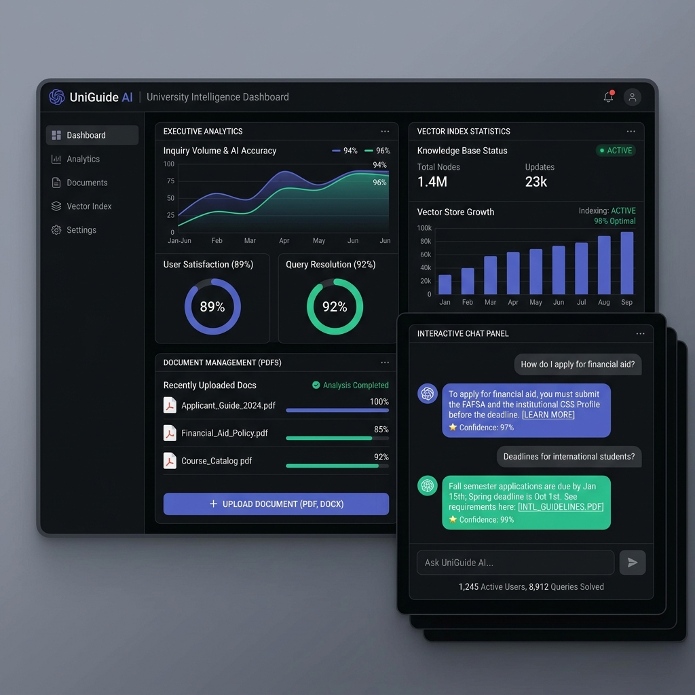
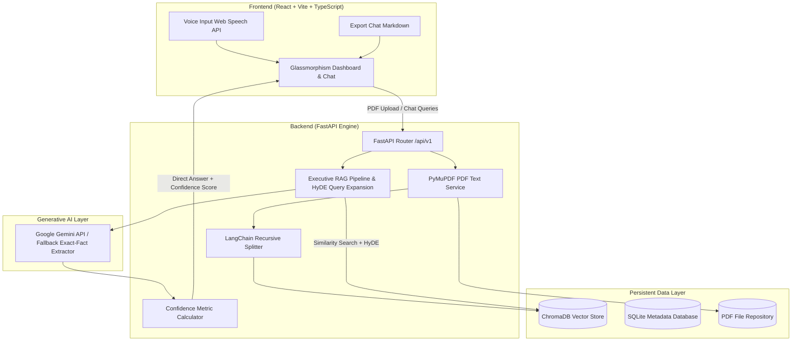

# UniGuide AI – Indian University Information Assistant (Executive RAG)

> A production-ready, full-stack Retrieval-Augmented Generation (RAG) assistant designed for Indian University students to query official PDF documents (admission guidelines, fee structures, examin[...]



---

## 🎬 Demo Video

[](https://drive.google.com/file/d/1KwtBSWSbu_Wxh8rFHdeJNfqwqW006rmq/view?usp=sharing)

**Watch the full demo:** [View Demo Video](https://drive.google.com/file/d/1KwtBSWSbu_Wxh8rFHdeJNfqwqW006rmq/view?usp=sharing)

See UniGuide AI in action as it processes university PDFs, answers student queries with confidence scores, and exports chat sessions in real-time.

---

## 🌟 Key Features & Recent Advancements

- 🎯 **Clean Direct Answers**: Strips away OCR noise, raw context headers, and document tags to present concise, exact answers directly to the student.
- ⚡ **Dynamic RAG Confidence Score Engine**: Calculates real-time mathematical confidence scores ($0.0 - 1.0$) and qualitative ratings (`High Confidence`, `Medium Confidence`, `Low Confidence`) [...]
- 📄 **Page-Level Vector Ingestion**: Extracts text page-by-page using PyMuPDF (`fitz`) while maintaining precise source and page metadata across chunking stages.
- 🎙️ **Voice Input Support**: Integrated Web Speech Recognition API allowing hands-free voice questions in the interactive chat interface.
- 💾 **Export Chat Guidance**: Export full student Q&A sessions into formatted Markdown (`.md`) files for printing or offline review.
- 🔄 **Dual LLM & Local Extraction Engine**: Primary execution via Google Gemini API (`gemini-1.5-flash` / `gemini-1.5-pro`) with an automated local exact-fact extraction fallback when offline.
- 📊 **Executive Analytics Dashboard**: Real-time stats tracking indexed vectors, total extracted pages, ChromaDB chunks, and document repository status.

---

## 🏗️ System Architecture



---

## 💻 Tech Stack

- **Frontend**: React 18, TypeScript, Vite, TailwindCSS, Axios, Lucide Icons, React Markdown, Web Speech API.
- **Backend**: Python 3.9+, FastAPI, PyMuPDF (`fitz`), SQLAlchemy, Pydantic v2.
- **Vector Search & ML**: LangChain, ChromaDB, `BAAI/bge-small-en-v1.5` embeddings, Google Gemini API (`google-genai`).

---

## 🚀 Quickstart & Setup Guide

### Prerequisites
- Python 3.9 or higher
- Node.js 18+ & npm
- Docker & Docker Compose (Optional for containerized run)
- Google Gemini API Key ([Get API Key](https://aistudio.google.com/))

---

### Method 1: Running via Local Launch Script

Run the automated production launcher from the root directory:

```bash
bash start_production.sh
```

---

### Method 2: Manual Local Setup

#### Step 1: Backend Setup
```bash
cd backend
python3 -m venv venv
source venv/bin/activate  # On Windows: venv\Scripts\activate
pip install -r requirements.txt

# Configure Environment Variables
cp .env.example .env
# Set your GEMINI_API_KEY inside backend/.env

# Launch FastAPI Server
python main.py
```
*Backend runs at:* `http://localhost:8000` (Swagger docs at `http://localhost:8000/docs`)

#### Step 2: Frontend Setup
```bash
cd frontend
npm install
npm run dev
```
*Frontend runs at:* `http://localhost:3000`

---

### Method 3: Running via Docker Compose

```bash
docker-compose up -d --build
```

---

## 🛰️ REST API Specifications

| Method | Endpoint | Description |
| :--- | :--- | :--- |
| `POST` | `/api/v1/upload` | Uploads a university PDF document and stores metadata in SQLite. |
| `POST` | `/api/v1/ingest` | Extracts text, chunks documents, generates vector embeddings, and stores in ChromaDB. |
| `POST` | `/api/v1/chat` | Runs similarity search, executes RAG pipeline, and returns direct answer with confidence score. |
| `GET` | `/api/v1/documents` | Lists all uploaded documents and vector index status. |
| `GET` | `/api/v1/documents/stats` | Returns aggregate statistics (total chunks, ingested files, pages). |
| `DELETE` | `/api/v1/documents/{id}` | Deletes PDF file, removes vector embeddings from ChromaDB, and clears database metadata. |

---

## 🧪 Example API Response (`POST /api/v1/chat`)

```json
{
  "answer": "Nirmala Institute of Technology (NiT) offers 3-year Diploma engineering courses in Mechanical, Civil, Chemical, Automobile, and Electrical Engineering.\n\n**Eligibility**: Candidates[...]",
  "sources": [],
  "execution_time_ms": 1240.5,
  "confidence_score": 0.92,
  "confidence_label": "High Confidence"
}
```

---

## 🛡️ License

Distributed under the MIT License. See `LICENSE` for details.
