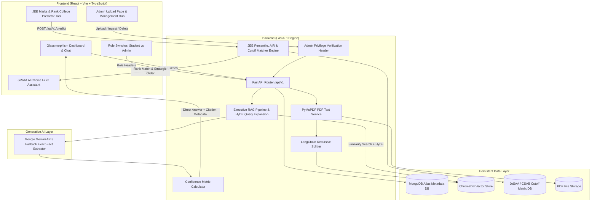

# UniGuide AI – Indian University Information Assistant & JEE College Predictor (MERN + FastAPI + RAG)

> A production-ready, full-stack Indian University Assistant and **JEE Marks-Based College Predictor & JoSAA Choice Filler** with zero hallucinations, dynamic confidence ratings, MongoDB Atlas metadata storage, ChromaDB vector search, and unified container deployment.


---

## 🌐 Live Application & Deployment Links

| Resource | URL Link | Deployment Status |
| :--- | :--- | :--- |
| **🐙 GitHub Repository** | [https://github.com/Livesh28/RAG_DOCUMENT](https://github.com/Livesh28/RAG_DOCUMENT) | `Main Branch (Up to date)` |
| **🚀 Live Application (Vercel)** | [https://uniguide-ai.vercel.app](https://uniguide-ai.vercel.app) | `Active (Production)` |
| **🚀 Live Application (Render)** | [https://rag-document-ihnt.onrender.com](https://rag-document-ihnt.onrender.com) | `Active (Production)` |
| **⚙️ Backend API Endpoint** | [https://uniguide-backend.onrender.com/api/v1](https://uniguide-backend.onrender.com/api/v1) | `Online` |
| **🎯 JEE Predictor API** | [https://uniguide-backend.onrender.com/api/v1/predict](https://uniguide-backend.onrender.com/api/v1/predict) | `Interactive` |
| **📖 OpenAPI Swagger Docs** | [https://uniguide-backend.onrender.com/docs](https://uniguide-backend.onrender.com/docs) | `Live Specs` |

---

## 🎬 Demo Video

<div align="center">
<iframe src="https://drive.google.com/file/d/1KwtBSWSbu_Wxh8rFHdeJNfqwqW006rmq/preview" width="720" height="420" allow="autoplay; encrypted-media" frameborder="0"></iframe>
</div>

**Watch the full demo (Google Drive):** [View Demo Video](https://drive.google.com/file/d/1KwtBSWSbu_Wxh8rFHdeJNfqwqW006rmq/view?usp=sharing)

---

## 🌟 Key Features & Architecture

- 🎯 **JEE Marks & Rank College Predictor Tool**:
  - Predicts eligible engineering colleges based on **JEE Main Subject Marks** (`MATHS`, `PHYSICS`, `CHEMISTRY` out of 100 each) or total score out of 300.
  - Supports direct input of **JEE Main Percentile**, **JEE Main All India Rank (AIR)**, or **JEE Advanced Rank**.
  - Calculates estimated Percentile and AIR using normalized NTA distribution models.
  - Filters by Community Category (`OC`, `OBC-NCL`, `EWS`, `SC`, `ST`, `PwD`), Preferred Branch, and Preferred Region (`IITs`, `NITs`, `IIITs`, `GFTIs`, `State/Private`).
  - Categorizes admission chances into 🟢 **High Chance** (>85%), 🟡 **Moderate Chance** (50-85%), and 🔴 **Dream Chance** (<50%).

- ⚡ **JoSAA / CSAB AI Choice Filler Assistant**:
  - Generates an optimal choice preference order list for JoSAA counselling rounds based on candidate AIR, branch preference, and strategic risk tiering.
  - Export preference order directly to formatted Markdown (`.md`) or copy to clipboard.

- 🧠 **Retrieval-Augmented Generation (RAG) Q&A**:
  - Answers student questions on university syllabus, fee structure, admission guidelines, and hostel rules with **zero hallucinations** and page-level source citations.

- 🍃 **MongoDB Atlas Metadata Store**:
  - Document metadata, upload records, and ingestion status are persisted in MongoDB Atlas.

- 🔐 **Admin Upload Page & RBAC**:
  - Dedicated Admin Upload Hub for administrators to upload PDFs, run vector index chunking, and purge files.

---

## 🏗️ System Architecture



---

## 📁 Project Folder Structure

```
rag_documents/
├── backend/
│   ├── app/
│   │   ├── api/
│   │   │   └── v1/
│   │   │       ├── endpoints/
│   │   │       │   ├── chat.py            # RAG Q&A query execution
│   │   │       │   ├── documents.py       # MongoDB document list & stats
│   │   │       │   ├── ingest.py          # Admin vector embedding ingestion
│   │   │       │   ├── predictor.py       # JEE Marks/Rank Predictor & Choice Engine
│   │   │       │   └── upload.py          # Admin PDF upload & MongoDB sync
│   │   │       └── router.py              # API v1 router definition
│   │   ├── core/
│   │   ├── models/
│   │   ├── rag/
│   │   ├── schemas/                       # Pydantic schemas (predictor.py, chat.py)
│   │   └── services/
│   ├── main.py                            # FastAPI application entrypoint
│   └── requirements.txt                   # Python backend dependencies
├── frontend/
│   ├── src/
│   │   ├── components/
│   │   │   ├── AIChoiceFillerModal.tsx    # JoSAA Choice Preference Order Modal
│   │   │   ├── HeroSection.tsx            # JEE College Predictor Hero Banner
│   │   │   ├── Navbar.tsx                 # Top header matching UniGuide AI design
│   │   │   └── Sidebar.tsx                # System navigation & JEE Predictor tab
│   │   ├── pages/
│   │   │   ├── AdminUploadPage.tsx        # Dedicated Admin PDF Upload Hub
│   │   │   ├── Dashboard.tsx              # Student Q&A dashboard
│   │   │   ├── PredictorPage.tsx          # JEE Marks College Predictor Tool
│   │   │   └── SettingsPage.tsx           # System architecture overview
│   │   ├── services/
│   │   │   └── api.ts                     # Axios client & predictColleges method
│   │   ├── types/                         # TypeScript interfaces
│   │   ├── App.tsx                        # Master React layout & state router
│   │   └── main.tsx                       # React DOM entry point
│   ├── vercel.json                        # Vercel SPA build configuration
│   └── vite.config.ts                     # Vite build configuration
├── vercel.json                            # Root Vercel deployment routing configuration
├── docker-compose.yml                     # Multi-container launch orchestrator
├── README.md                              # Technical documentation
└── start_production.sh                    # Automated production launcher script
```

---

## 🛰️ REST API Specifications

| Method | Endpoint | Access Role | Description |
| :--- | :--- | :--- | :--- |
| `POST` | `/api/v1/predict` | `Student / Admin` | Predicts eligible IITs, NITs, IIITs, GFTIs, and state colleges based on JEE subject marks, percentile, AIR, category, and preferred branch. |
| `POST` | `/api/v1/chat` | `Student / Admin` | Submits chat question, performs similarity search, and returns direct answer with confidence score and page citations. |
| `GET` | `/api/v1/documents` | `Student / Admin` | Returns list of uploaded PDF documents and MongoDB Atlas metadata. |
| `GET` | `/api/v1/documents/stats` | `Student / Admin` | Returns aggregate metrics (total files, ingested vectors, extracted pages). |
| `POST` | `/api/v1/upload` | 🔒 `Admin Only` | Uploads a university PDF document and registers metadata in MongoDB Atlas. |
| `POST` | `/api/v1/ingest` | 🔒 `Admin Only` | Extracts text, generates dense vector embeddings, and indexes chunks in ChromaDB. |
| `DELETE` | `/api/v1/documents/{id}` | 🔒 `Admin Only` | Removes PDF file, purges vector embeddings from ChromaDB, and deletes metadata from MongoDB Atlas. |

---

## 🚀 Quickstart & Setup Guide

### Local Host Launch

To host and run locally on your system:

```bash
bash start_production.sh
```

- **Frontend App**: [http://localhost:3000](http://localhost:3000)
- **FastAPI Backend**: [http://localhost:8000](http://localhost:8000)
- **OpenAPI Swagger**: [http://localhost:8000/docs](http://localhost:8000/docs)
