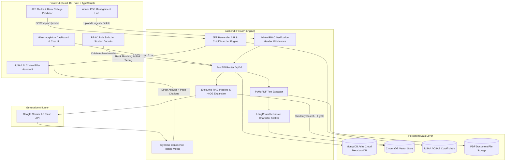

# UniGuide AI – Indian University Information Assistant & JEE College Predictor (MERN + FastAPI + RAG)

[](LICENSE)
[](https://python.org)
[](https://fastapi.tiangolo.com)
[](https://reactjs.org)
[](https://vitejs.dev)
[](https://www.typescriptlang.org)
[](https://www.trychroma.com)
[](https://www.mongodb.com/cloud/atlas)
[](https://ai.google.dev)
[](https://frontend-peach-nine-9dyn34fhbi.vercel.app)
[](https://rag-document-ihnt.onrender.com)

> **UniGuide AI** is a production-grade, full-stack Indian University Information Assistant and **JEE Marks-Based College Predictor & JoSAA Choice Filler**. Powered by Retrieval-Augmented Generation (RAG), ChromaDB vector search, Google Gemini AI, MongoDB Atlas metadata persistence, and a custom NTA score-to-rank estimation engine, UniGuide AI delivers zero-hallucination document Q&A with page-level PDF citations alongside precise college admission predictions.

---

## 🌐 Live Application & Deployment Links

| Resource | URL Link | Deployment Status | Description |
| :--- | :--- | :--- | :--- |
| **🐙 GitHub Repository** | [https://github.com/Livesh28/RAG_DOCUMENT](https://github.com/Livesh28/RAG_DOCUMENT) | `Main Branch (Up to date)` | Complete source code, Docker configs, and setup scripts |
| **🚀 Live Application (Vercel)** | [https://frontend-peach-nine-9dyn34fhbi.vercel.app](https://frontend-peach-nine-9dyn34fhbi.vercel.app) | `Active (Production)` | Primary SPA frontend deployed on Vercel Edge Network |
| **🚀 Live Application (Render)** | [https://rag-document-ihnt.onrender.com](https://rag-document-ihnt.onrender.com) | `Active (Production)` | Secondary full-stack deployment on Render |
| **⚙️ Backend API Base** | [https://rag-document-ihnt.onrender.com/api/v1](https://rag-document-ihnt.onrender.com/api/v1) | `Online (REST API)` | FastAPI REST API router endpoint |
| **🎯 JEE Predictor API** | [https://rag-document-ihnt.onrender.com/api/v1/predict](https://rag-document-ihnt.onrender.com/api/v1/predict) | `Interactive` | Post endpoint for score/rank prediction & choice matrix |
| **📖 OpenAPI Swagger Docs** | [https://rag-document-ihnt.onrender.com/docs](https://rag-document-ihnt.onrender.com/docs) | `Live Specs` | Interactive API testing playground and schema viewer |

---

## 🎬 Demo Video

<div align="center">
<iframe src="https://drive.google.com/file/d/1KwtBSWSbu_Wxh8rFHdeJNfqwqW006rmq/preview" width="720" height="420" allow="autoplay; encrypted-media" frameborder="0"></iframe>
</div>

**Watch the full demo on Google Drive:** [View UniGuide AI Demo Video](https://drive.google.com/file/d/1KwtBSWSbu_Wxh8rFHdeJNfqwqW006rmq/view?usp=sharing)

---

## 🌟 Key Features & Capabilities

### 🎯 1. JEE Marks & Rank College Predictor Tool
- **Multi-Mode Inputs**:
  - **Subject Marks**: Direct input of Mathematics, Physics, and Chemistry scores (0–100 each, total 0–300).
  - **JEE Main Percentile**: Direct NTA percentile input (0–100%).
  - **JEE Main AIR**: Direct All India Rank input.
  - **JEE Advanced Rank**: Direct rank input for IIT admission matching.
- **NTA Normalization Engine**: Calculates estimated NTA percentile and All India Rank (AIR) based on historical NTA score distribution models.
- **JoSAA & CSAB Cutoff Matching Matrix**: Searches through actual opening and closing ranks for IITs, NITs, IIITs, GFTIs, and top State/Private universities.
- **Reservation & Quota Support**: Filters by Category (`OPEN`, `OBC-NCL`, `EWS`, `SC`, `ST`, `PwD`), Gender Quota (`Gender-Neutral`, `Female-Only`), and Home State quota.
- **Tiered Admission Probability**:
  - 🟢 **High Chance** (>85% probability)
  - 🟡 **Moderate Chance** (50–85% probability)
  - 🔴 **Dream Chance** (<50% probability)

### ⚡ 2. JoSAA / CSAB AI Choice Filler Assistant
- **Automated Preference Generator**: Builds a strategic choice preference order list for JoSAA / CSAB counselling rounds based on candidate AIR, preferred branch, and risk tiering.
- **Export Capabilities**: Export generated preference orders directly to formatted Markdown (`.md`) files or copy to clipboard for immediate use.

### 🧠 3. Retrieval-Augmented Generation (RAG) Document Q&A
- **Zero Hallucination Guarantee**: Strict prompt engineering enforces ground-truth extraction from official university document PDFs.
- **Dense Vector Search**: Powered by `BAAI/bge-small-en-v1.5` embeddings and local `ChromaDB` vector store.
- **HyDE Query Expansion**: Uses Hypothetical Document Embeddings (HyDE) to expand user queries for superior semantic matching accuracy.
- **Page-Level Citations**: Every answer provides precise source PDF filenames and 1-based page numbers.
- **Dynamic Confidence Scoring**: Calculates confidence metrics (0.0 to 1.0) and assigns rating labels (`High`, `Medium`, `Low`).
- **Multi-Turn Dialogue Context**: Preserves past chat turns for follow-up questions.

### 🍃 4. MongoDB Atlas & Hybrid Persistence
- **Cloud Metadata Sync**: Persists PDF metadata, upload records, chunk counts, and file stats in MongoDB Atlas.
- **Local Fallback Mode**: Gracefully operates using SQLite/hybrid storage if cloud database connectivity is restricted.

### 🔐 5. Admin Upload Hub & Role-Based Access Control (RBAC)
- **Header-Based RBAC**: Secure endpoints requiring `X-Admin-Role: admin` headers.
- **Document Pipeline**: Multi-file PDF drag-and-drop upload, automated PyMuPDF text extraction, LangChain recursive text chunking, and ChromaDB vector indexing.
- **Document Purging**: Single-click removal of PDF files, metadata, and associated vector embeddings.

---

## 🏗️ System Architecture



---

## 📁 Project Folder Structure

```
rag_documents/
├── backend/
│   ├── app/
│   │   ├── api/
│   │   │   └── v1/
│   │   │       ├── endpoints/
│   │   │       │   ├── chat.py            # RAG Q&A query execution (/chat)
│   │   │       │   ├── documents.py       # MongoDB document list & stats (/documents)
│   │   │       │   ├── ingest.py          # Admin vector embedding ingestion (/ingest)
│   │   │       │   ├── predictor.py       # JEE Predictor & Choice Filler (/predict)
│   │   │       │   └── upload.py          # Admin PDF upload & metadata sync (/upload)
│   │   │       └── router.py              # API v1 router definition
│   │   ├── core/                          # Logging, database connection & config
│   │   │   ├── config.py
│   │   │   ├── database.py
│   │   │   └── logging.py
│   │   ├── models/                        # MongoDB & Pydantic data models
│   │   ├── rag/                           # RAG pipeline, HyDE expansion & embeddings
│   │   │   ├── embeddings.py
│   │   │   ├── hyde.py
│   │   │   ├── pipeline.py
│   │   │   └── vector_store.py
│   │   ├── schemas/                       # Pydantic schemas (predictor.py, chat.py)
│   │   └── services/                      # Cutoff database & PDF parsing services
│   ├── chroma_db/                         # Persistent ChromaDB vector index directory
│   ├── uploads/                           # Uploaded PDF document storage
│   ├── main.py                            # FastAPI application entrypoint
│   └── requirements.txt                   # Python backend dependencies
├── frontend/
│   ├── src/
│   │   ├── components/
│   │   │   ├── AIChoiceFillerModal.tsx    # JoSAA Choice Preference Order Modal
│   │   │   ├── HeroSection.tsx            # JEE College Predictor Hero Banner
│   │   │   ├── Navbar.tsx                 # Top navigation header with role switcher
│   │   │   └── Sidebar.tsx                # Navigation sidebar
│   │   ├── pages/
│   │   │   ├── AdminUploadPage.tsx        # Dedicated Admin PDF Upload Hub
│   │   │   ├── Dashboard.tsx              # Student Q&A dashboard
│   │   │   ├── PredictorPage.tsx          # JEE Marks & Rank College Predictor Tool
│   │   │   └── SettingsPage.tsx           # System architecture & specs page
│   │   ├── services/
│   │   │   └── api.ts                     # Axios REST client & API bindings
│   │   ├── types/                         # TypeScript interfaces & types
│   │   ├── App.tsx                        # Master React application router
│   │   └── main.tsx                       # React DOM entry point
│   ├── vercel.json                        # Vercel SPA build & API proxy configuration
│   ├── vite.config.ts                     # Vite build configuration
│   └── package.json                       # Frontend dependencies & scripts
├── vercel.json                            # Root Vercel routing configuration
├── docker-compose.yml                     # Multi-container orchestrator configuration
├── Dockerfile                             # Production container build file
├── README.md                              # Technical documentation
└── start_production.sh                    # Automated launcher script
```

---

## 🛰️ REST API Specifications

| Method | Endpoint | Access Role | Description |
| :--- | :--- | :--- | :--- |
| `POST` | `/api/v1/predict` | `Student / Admin` | Predicts eligible IITs, NITs, IIITs, GFTIs & state colleges; generates JoSAA choice preferences. |
| `POST` | `/api/v1/chat` | `Student / Admin` | Submits chat question, performs vector similarity search, and returns direct answer with citations. |
| `GET` | `/api/v1/documents` | `Student / Admin` | Returns list of uploaded PDF documents and MongoDB metadata records. |
| `GET` | `/api/v1/documents/stats` | `Student / Admin` | Returns aggregate metrics (total files, ingested vectors, extracted pages). |
| `POST` | `/api/v1/upload` | 🔒 `Admin Only` | Uploads a PDF document and registers metadata in MongoDB Atlas. |
| `POST` | `/api/v1/ingest` | 🔒 `Admin Only` | Extracts text, generates dense vector embeddings, and indexes chunks in ChromaDB. |
| `DELETE` | `/api/v1/documents/{id}` | 🔒 `Admin Only` | Purges PDF file, removes ChromaDB vector embeddings, and deletes MongoDB metadata. |

---

### 📝 Example API Request & Response Payloads

#### 1. College Predictor (`POST /api/v1/predict`)

**Request Payload:**
```json
{
  "input_mode": "marks",
  "maths_marks": 85.0,
  "physics_marks": 80.0,
  "chemistry_marks": 78.0,
  "category": "OPEN",
  "gender": "Gender-Neutral",
  "home_state": "All",
  "preferred_branch": "Computer Science",
  "institution_type": "All"
}
```

**Response Payload:**
```json
{
  "total_score": 243.0,
  "maths_score": 85.0,
  "physics_score": 80.0,
  "chemistry_score": 78.0,
  "estimated_percentile": 99.45,
  "estimated_air": 6820,
  "category_rank": 6820,
  "category": "OPEN",
  "gender": "Gender-Neutral",
  "input_mode": "marks",
  "total_matches": 42,
  "high_chance_count": 18,
  "moderate_chance_count": 14,
  "dream_chance_count": 10,
  "predictions": [
    {
      "id": "pred_nit_trichy_cse",
      "institute_name": "National Institute of Technology Tiruchirappalli",
      "short_name": "NIT Trichy",
      "type": "NIT",
      "location": "Tiruchirappalli, Tamil Nadu",
      "state": "Tamil Nadu",
      "branch": "Computer Science and Engineering",
      "category": "OPEN",
      "opening_rank": 1100,
      "closing_rank": 7500,
      "candidate_rank": 6820,
      "chance_level": "High",
      "chance_percentage": 91.2,
      "avg_package_lpa": 27.2,
      "annual_fee_lakhs": 1.78,
      "nirf_rank": 9,
      "recommendation_reason": "Your estimated AIR 6,820 comfortably falls within the historical closing rank of 7,500."
    }
  ],
  "choice_filling_order": [
    {
      "preference_number": 1,
      "institute_name": "National Institute of Technology Tiruchirappalli",
      "branch": "Computer Science and Engineering",
      "type": "NIT",
      "closing_rank": 7500,
      "chance_level": "High",
      "strategy_note": "High-confidence target choice for your rank tier."
    }
  ]
}
```

#### 2. RAG Document Q&A (`POST /api/v1/chat`)

**Request Payload:**
```json
{
  "question": "What is the minimum eligibility criteria and attendance requirement for semester exams?",
  "document_name": null,
  "conversation_history": []
}
```

**Response Payload:**
```json
{
  "answer": "According to the official university guidelines, students must maintain a minimum of 75% aggregate attendance in each course to be eligible to appear for the end-semester examinations. A relaxation of up to 10% may be granted on medical grounds subject to approval.",
  "sources": [
    {
      "document": "Academic_Regulations_2025.pdf",
      "page": 14
    }
  ],
  "execution_time_ms": 412.5,
  "confidence_score": 0.94,
  "confidence_label": "High"
}
```

---

## ⚙️ Environment Variables Configuration (`.env`)

Create a `.env` file inside the `backend/` directory with the following configuration:

```env
# Server Configuration
HOST=0.0.0.0
PORT=8000
ENVIRONMENT=production

# MongoDB Atlas Persistent Database
MONGO_URI=mongodb+srv://<username>:<password>@cluster0.mongodb.net/uniguide_db?retryWrites=true&w=majority
DATABASE_NAME=uniguide_db

# Google Gemini API Key
GEMINI_API_KEY=your_google_gemini_api_key_here

# Vector Store Settings
CHROMA_PERSIST_DIRECTORY=./chroma_db
EMBEDDING_MODEL_NAME=BAAI/bge-small-en-v1.5

# Security
JWT_SECRET=your_super_secret_jwt_key_here
ADMIN_SECRET_KEY=admin
```

For the `frontend/` directory, configure `.env` if pointing to a custom backend API:

```env
VITE_API_BASE_URL=https://rag-document-ihnt.onrender.com
```

---

## 🚀 Quickstart & Setup Guide

### 📋 Prerequisites
- **Node.js**: `v20.15.0+`
- **Python**: `v3.9+`
- **Docker & Docker Compose**: *(Optional, for containerized run)*

---

### Option A: Automated One-Step Launch (Local Host)

Run the included production launcher script from the project root:

```bash
bash start_production.sh
```

- **Frontend Application**: [http://localhost:3000](http://localhost:3000)
- **FastAPI Backend Server**: [http://localhost:8000](http://localhost:8000)
- **OpenAPI Swagger UI**: [http://localhost:8000/docs](http://localhost:8000/docs)

---

### Option B: Manual Step-by-Step Launch

#### 1. Start FastAPI Backend
```bash
cd backend

# Create and activate virtual environment
python3 -m venv venv
source venv/bin/activate

# Install Python dependencies
pip install -r requirements.txt

# Launch FastAPI server with live reload
PYTHONPATH=. python main.py
```

#### 2. Start React Frontend
```bash
cd frontend

# Install Node dependencies
npm install

# Start Vite development server on port 3000
npm run dev -- --port 3000
```

---

### Option C: Unified Docker Container Launch

Build and launch all services using Docker Compose:

```bash
docker-compose up -d --build
```

To stop containers:
```bash
docker-compose down
```

---

## 🌐 Deployment Instructions

### Deploying Frontend on Vercel

1. Install Vercel CLI:
   ```bash
   npm install -g vercel
   ```
2. Navigate to the `frontend` directory and deploy:
   ```bash
   cd frontend
   vercel --prod
   ```
3. The included `frontend/vercel.json` automatically handles single-page application (SPA) client-side routing and proxies `/api/v1/*` requests to the Render backend service.

### Deploying Backend on Render

1. Connect the GitHub repository `Livesh28/RAG_DOCUMENT` to Render.
2. Render automatically detects `render.yaml` and provisions the FastAPI Web Service using the root `Dockerfile`.
3. Set the required environment variables (`GEMINI_API_KEY`, `MONGO_URI`) in the Render Dashboard environment panel.

---

## 📄 License & Acknowledgments

- **License**: Released under the [MIT License](LICENSE).
- **Cutoff Data**: Powered by JoSAA / CSAB opening and closing rank matrices.
- **LLM Engine**: Powered by Google Gemini 1.5 Flash API & LangChain.
- **Vector Database**: Powered by ChromaDB & BAAI/bge-small-en-v1.5 embeddings.

---

<div align="center">
  <b>UniGuide AI</b> — Elevating Indian Higher Education Guidance with Zero-Hallucination RAG & Intelligent Rank Matching.
</div>
